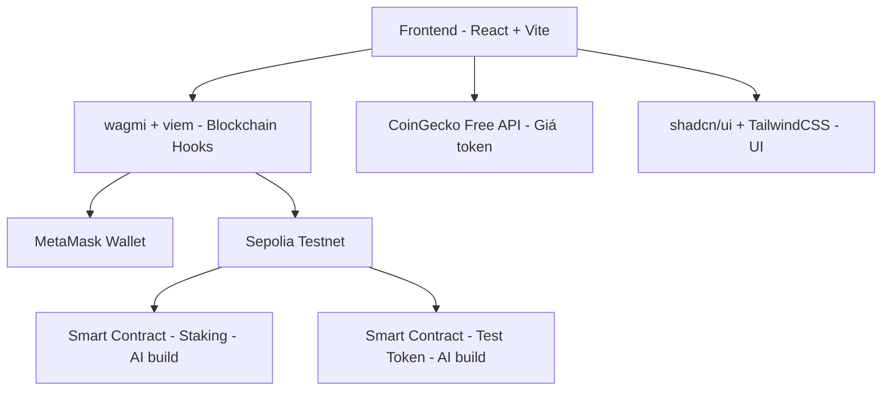

# 🚀 Crypto Dashboard - Token Tracking & Staking (Testnet)

> **Cập nhật lần cuối**: 2026-03-16  
> **Trạng thái**: 🟡 Phase 1 — Setup & Foundation

---

## 📋 Tổng quan dự án

Xây dựng một **Crypto Dashboard** cho phép:
- **Tracking Token**: Theo dõi giá, số dư, lịch sử giao dịch của các token trên testnet
- **Stake Token**: Cho phép stake/unstake token trên testnet
- **Dashboard**: Hiển thị tổng quan portfolio, biểu đồ, thống kê

---

## 👥 Phân chia vai trò

| Vai trò | Người đảm nhiệm | Phạm vi |
|---|---|---|
| **Frontend** | 🧑‍💻 **TÔI** (User) | UI/UX, Components, State, Routing, Styling |
| **Blockchain/Backend** | 🤖 **AI Assistant** | Smart Contract (Solidity), Deploy, ABI, Blockchain config |

> [!IMPORTANT]
> - AI **KHÔNG** được tự ý sửa code Frontend — chỉ đưa gợi ý và hướng dẫn
> - AI **PHẢI** báo cáo rõ ràng mọi thay đổi blockchain/backend đã thực hiện
> - Sau mỗi lần hỏi, AI sẽ review code và đưa nhận xét cải thiện

---

## 🏗️ Kiến trúc dự án



---

## 🛠️ Tech Stack chính thức (TẤT CẢ MIỄN PHÍ)

### Frontend (User đảm nhiệm)
| Công nghệ | Mục đích | Chi phí |
|---|---|---|
| **Vite + React** | Framework chính | ✅ FREE |
| **TypeScript** | Type safety | ✅ FREE |
| **shadcn/ui** | UI Components (copy-paste, full control) | ✅ FREE |
| **TailwindCSS** | Styling | ✅ FREE |
| **Recharts** | Biểu đồ giá token | ✅ FREE |
| **wagmi** (v2) | React hooks cho Ethereum (connect, read, write) | ✅ FREE |
| **viem** | TypeScript Ethereum interface (wagmi dùng bên dưới) | ✅ FREE |
| **@tanstack/react-query** | Caching & data fetching (wagmi yêu cầu) | ✅ FREE |
| **react-router-dom** | Routing | ✅ FREE |
| **zustand** | State management (nhẹ, đơn giản) | ✅ FREE |

### Blockchain/Backend (AI đảm nhiệm)
| Công nghệ | Mục đích | Chi phí |
|---|---|---|
| **Solidity** | Viết Smart Contract | ✅ FREE |
| **Hardhat** | Dev & Deploy Smart Contract | ✅ FREE |
| **Sepolia Testnet** | Blockchain testnet | ✅ FREE |

### Dịch vụ bên thứ 3 (Free tier)
| Dịch vụ | Mục đích | Giới hạn Free |
|---|---|---|
| **Alchemy** | RPC Provider | 300M compute units/month |
| **CoinGecko API** | Giá token real-time | 10-30 calls/min |
| **Etherscan** (Sepolia) | Scan transactions | 5 calls/sec |
| **Vercel** | Deploy frontend | Unlimited cho personal |

---

## 🔑 Tại sao chọn wagmi + viem?

### Dành cho Frontend Developer (không cần biết code blockchain)

**wagmi** cung cấp React hooks giúp tương tác blockchain giống như gọi API:

```tsx
// Kết nối wallet — chỉ 1 hook
const { connect } = useConnect();
const { address, isConnected } = useAccount();

// Đọc balance — chỉ 1 hook
const { data: balance } = useBalance({ address });

// Gọi smart contract — chỉ 1 hook
const { data } = useReadContract({
  address: CONTRACT_ADDRESS,
  abi: stakingABI,
  functionName: 'getStakedAmount',
  args: [address],
});

// Ghi smart contract (stake token) — chỉ 1 hook
const { writeContract } = useWriteContract();
writeContract({
  address: CONTRACT_ADDRESS,
  abi: stakingABI,
  functionName: 'stake',
  args: [amount],
});
```

### Khái niệm cần HIỂU (không cần code)

| Khái niệm | Giải thích ngắn | Bạn cần biết? |
|---|---|---|
| **Wallet** | Ví điện tử, giống tài khoản ngân hàng | ✅ Hiểu để làm UI connect |
| **Address** | Địa chỉ ví, giống số tài khoản (0x...) | ✅ Hiểu để hiển thị |
| **Transaction** | Giao dịch trên blockchain | ✅ Hiểu để show trạng thái |
| **Gas** | Phí giao dịch | ✅ Hiểu để thông báo user |
| **Smart Contract** | Chương trình chạy trên blockchain | ✅ Hiểu nó làm gì, không cần viết |
| **ABI** | Interface của Smart Contract | ✅ Biết nó là gì để truyền vào wagmi |
| **Testnet** | Blockchain thử nghiệm (tiền không có giá trị) | ✅ Hiểu để config |
| **Staking** | Khóa token để nhận phần thưởng | ✅ Hiểu flow để làm UI |
| **Solidity** | Ngôn ngữ viết Smart Contract | ❌ AI sẽ viết |
| **EVM bytecode** | Code chạy trên blockchain | ❌ Không cần biết |
| **Merkle Tree** | Cấu trúc dữ liệu blockchain | ❌ Không cần biết |

---

## 📁 Cấu trúc thư mục

```
crypto-dashboard-tracker/
├── public/
│   └── assets/              # Images, icons
├── src/
│   ├── components/          # UI Components (shadcn + custom)
│   │   ├── ui/              # shadcn/ui components
│   │   ├── common/          # Shared components (Header, Sidebar...)
│   │   ├── dashboard/       # Dashboard page components
│   │   ├── wallet/          # Wallet connection components
│   │   └── staking/         # Staking page components
│   ├── hooks/               # Custom React hooks
│   │   ├── useTokenPrice.ts # Fetch token prices
│   │   └── useStaking.ts    # Staking logic hooks
│   ├── services/            # API services
│   │   └── coingecko.ts     # CoinGecko API calls
│   ├── lib/                 # Utilities & config
│   │   ├── utils.ts         # shadcn utils (cn function)
│   │   └── wagmi.ts         # wagmi config
│   ├── contracts/           # Smart contract ABIs (AI cung cấp)
│   │   └── stakingABI.ts
│   ├── types/               # TypeScript interfaces
│   ├── constants/           # Constants (addresses, chains...)
│   ├── pages/               # Page components
│   │   ├── Dashboard.tsx
│   │   ├── Staking.tsx
│   │   └── Portfolio.tsx
│   ├── App.tsx
│   ├── main.tsx
│   └── index.css            # TailwindCSS imports
├── contracts/               # Solidity files (AI quản lý)
│   ├── StakingContract.sol
│   └── TestToken.sol
├── tailwind.config.ts
├── vite.config.ts
├── tsconfig.json
├── package.json
└── README.md
```

---

## 🗺️ Lộ trình phát triển (Roadmap)

### ✅ Phase 0: Quyết định & Chuẩn bị (DONE)
- [x] Chọn tech stack: Vite + React + shadcn/ui + TailwindCSS
- [x] Chọn blockchain tools: wagmi + viem
- [x] Phân chia vai trò: Frontend (User) / Blockchain (AI)
- [x] Tạo document theo dõi

### 🟡 Phase 1: Setup & Foundation (Tuần 1)
- [ ] Khởi tạo Vite + React + TypeScript project
- [ ] Cài đặt và cấu hình TailwindCSS
- [ ] Cài đặt và cấu hình shadcn/ui
- [ ] Cài đặt wagmi + viem + @tanstack/react-query
- [ ] Setup cấu trúc thư mục
- [ ] Cài đặt MetaMask browser extension
- [ ] Đăng ký Alchemy (free) → lấy RPC URL
- [ ] Lấy Sepolia ETH từ faucet
- [ ] Tạo wagmi config (kết nối Sepolia)

### ⬜ Phase 2: Wallet Integration (Tuần 2)
- [ ] Tạo component ConnectWallet button
- [ ] Hiển thị address & balance khi connected
- [ ] Handle disconnect
- [ ] Handle wrong network → auto switch to Sepolia
- [ ] Tạo layout chung (Header + Sidebar + Content)

### ⬜ Phase 3: Token Tracking Dashboard (Tuần 3-4)
- [ ] Tích hợp CoinGecko API
- [ ] Tạo Token List component
- [ ] Tạo Token Detail với biểu đồ giá (Recharts)
- [ ] Search & Filter tokens
- [ ] Portfolio overview (tổng giá trị, % thay đổi)
- [ ] Responsive design

### ⬜ Phase 4: Smart Contract (Tuần 5-6) — AI đảm nhiệm
- [ ] Viết TestToken ERC20 contract
- [ ] Viết Staking contract (stake, unstake, claim rewards)
- [ ] Test contracts
- [ ] Deploy lên Sepolia
- [ ] Cung cấp ABI + contract addresses cho Frontend

### ⬜ Phase 5: Staking UI (Tuần 7-8) — User + AI phối hợp
- [ ] UI Stake/Unstake form
- [ ] Hiển thị staking info (amount, rewards, APY)
- [ ] Transaction status (pending, success, failed)
- [ ] Staking history
- [ ] Error handling & loading states

### ⬜ Phase 6: Polish & Deploy (Tuần 9-10)
- [ ] Dark/Light mode toggle
- [ ] Animations & transitions
- [ ] Performance optimization
- [ ] Deploy lên Vercel
- [ ] Viết README documentation

---

## ⚠️ Lưu ý quan trọng

> [!CAUTION]
> - **TUYỆT ĐỐI** không sử dụng Mainnet khi đang phát triển
> - **KHÔNG BAO GIỜ** commit private key hoặc `.env` lên GitHub
> - Sử dụng `.env` file cho API keys và thêm vào `.gitignore`

> [!TIP]
> - Bắt đầu từ đơn giản, tăng dần độ phức tạp
> - Commit thường xuyên, message rõ ràng
> - Hỏi AI review code sau mỗi feature hoàn thành

---

## 📝 Nhật ký hoạt động (Activity Log)

| Ngày | Hoạt động | Trạng thái |
|---|---|---|
| 2026-03-16 | Khởi tạo dự án, phân tích yêu cầu | ✅ Done |
| 2026-03-16 | Chọn tech stack & phân chia vai trò | ✅ Done |
| 2026-03-16 | Quyết định dùng wagmi + viem thay ethers.js | ✅ Done |
| ... | Phase 1: Setup project | 🟡 Đang chờ |

---

## 🔗 Tài liệu tham khảo

- [wagmi docs](https://wagmi.sh/)
- [viem docs](https://viem.sh/)
- [shadcn/ui docs](https://ui.shadcn.com/)
- [TailwindCSS docs](https://tailwindcss.com/docs)
- [Recharts docs](https://recharts.org/)
- [CoinGecko API](https://docs.coingecko.com/reference/introduction)
- [Sepolia Faucet](https://www.alchemy.com/faucets/ethereum-sepolia)
- [Alchemy Dashboard](https://dashboard.alchemy.com/)
